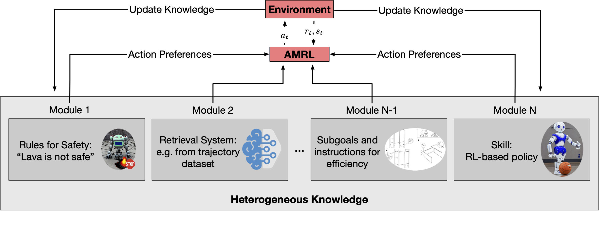

# Heterogeneous Knowledge for Augmented Modular Reinforcement Learning
This repository contains the code for the paper [Heterogeneous Knowledge for Augmented Modular Reinforcement Learning](https://arxiv.org/abs/2306.01158).

<p align="center">
    
</p>

## Getting started
Install the required packages from requirements.txt

## Features
Features from rl-starter-files repo but for augmented modular rl agents and baselines.

- **Script to train**, including:
  - Log in txt, CSV and Tensorboard
  - Save model
  - Stop and restart training
  - Use A2C or PPO algorithms
- **Script to visualize**, including:
  - Act by sampling or argmax
  - Save as Gif
- **Script to evaluate**, including:
  - Act by sampling or argmax
  - List the worst performed episodes


## Example of use

Train, a skill policy on the `MiniGrid-DoorKey-5x5-v0` environment:

1. Train the agent on the `MiniGrid-DoorKey-5x5-v0` environment with PPO algorithm:

```
python3 -m scripts.train --algo ppo --agent AC --env MiniGrid-DoorKey-5x5-v0 --model DoorKey --save-interval 10 --frames 80000
```

2. Collect retrieval data based on a trained agent:

```
python3 -m scripts.evaluate --env MiniGrid-DoorKey-5x5-v0 --model DoorKey --embeddings
```
This will store the retrieval dataset in the same directory as the model with file name "retrieval_data.pickle"


3. Train AMRL agent on the `MiniGrid-DoorKey-8x8-v0` environment relying on a skill from DoorKey 5x5, retrieval data from DoorKey 5x5, and rules:
The following trains AMRL with soft selection:
```
python3 -m scripts.train --algo ppo --agent AMRL --env MiniGrid-DoorKey-8x8-v0 --model AMRL_DoorKey --modules skill retrieval rules --module_dirs DoorKey DoorKey Rules --save-interval 10 --frames 80000
```
The following trains AMRL with hard selection:
```
python3 -m scripts.train --algo ppo --agent AMRL_hard --env MiniGrid-DoorKey-8x8-v0 --model AMRL_DoorKey --modules skill retrieval rules --module_dirs DoorKey DoorKey Rules --save-interval 10 --frames 80000
```

## Files

This package contains:
- scripts to:
  - train agents \
  in `script/train.py` ([more details](#scripts-train))
  - visualize agent's behavior \
- different model architectures and modules \
in `models`
- utilitarian classes and functions used by the scripts \
in `utils`

## Citation
If you find this repo useful please consider citing:
```
@misc{wolf2024heterogeneousknowledgeaugmentedmodular,
      title={Heterogeneous Knowledge for Augmented Modular Reinforcement Learning}, 
      author={Lorenz Wolf and Mirco Musolesi},
      year={2024},
      eprint={2306.01158},
      archivePrefix={arXiv},
      primaryClass={cs.LG},
      url={https://arxiv.org/abs/2306.01158}, 
}
```

## Acknowledgements
This repository builds on the following two repositories:
* rl-starter-files https://github.com/lcswillems/rl-starter-files
* KIAN https://github.com/Pascalson/KGRL/tree/main
